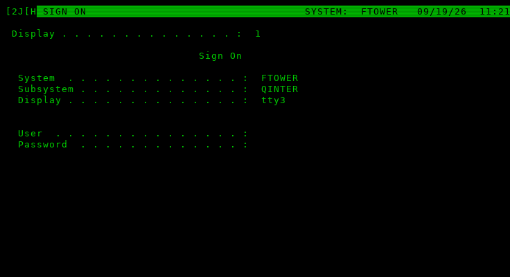
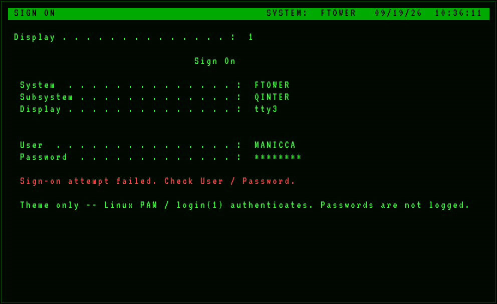

# as400-signon

IBM **AS/400 / 5250-style Sign On** for the Linux virtual console — a drop-in
replacement for Debian’s stock TTY login *presentation* (`agetty` / `/etc/issue`).

Built to match the fTower **homelab console dashboard** aesthetic: one phosphor
green, intensity and reverse-video for emphasis, uppercase labels, fixed-column
values, and CL-flavoured wording — not “green hacker text.”



*Sign On on `tty3` — black-on-green header, dotted leaders, User / Password fields.
Captured from `bin/as400-signon` dump mode and rendered VT-style.*



*Failed sign-on: amber/red is reserved for errors only (never white-for-warn).*

## Goal

When you switch to a getty on tty*N* (or open a new VT), you should see a
**Sign On** screen that feels like OS/400, then authenticate with the real
Linux account (PAM). After a successful login, the session continues normally
(shell, or hand off to an existing dashboard like `hldash` / tmux `dash`).

This project owns the **login presentation + getty integration**. It does not
replace PAM, systemd, or SSH.

**Security model:** pre-auth UI only. The program collects User + Password on
the TTY, checks the password with `unix_chkpwd` (same helper PAM uses), then
`exec`s `/bin/login -f` so session setup is still real `login`(1). Passwords
are never logged, written to disk, or exported in the environment.

## ASCII mock

```
+------------------------------------------------------------------------------+
| SIGN ON                                      SYSTEM:  FTOWER   09/19/26 10:35 |
+------------------------------------------------------------------------------+
  Display . . . . . . . . . . . . . . :  1

                               Sign On

  System  . . . . . . . . . . . . . . :  FTOWER
  Subsystem . . . . . . . . . . . . . :  QINTER
  Display . . . . . . . . . . . . . . :  tty3


  User  . . . . . . . . . . . . . . . :  ________
  Password  . . . . . . . . . . . . . :  ________
```

(On a real VT the top line is black-on-green, not ASCII box art.)

## Design rules (5250)

- **One colour** (green). Warn/critical exceptions may use amber/red sparingly;
  never use bright white for “warm” status (reads as broken phosphor).
- **Intensity + reverse video** (explicit `0;30;42` bar, not bare `\033[7m`) for
  emphasis — same fix as `os400-shell.bashrc`.
- **Uppercase field labels** with dotted leaders to a value column.
- **ASCII + verified box-drawing only** — console fonts are often 512-glyph PSF
  with no braille; what looks fine over SSH can garbage on the physical VT.
- Prefer OS/400 vocabulary: *Sign On*, *User*, *Password*, *System*, *Subsystem*.

## Layout

```
as400-signon/
  README.md
  bin/as400-signon              # Sign On UI (bash)
  scripts/install.sh            # opt-in per tty
  scripts/uninstall.sh          # reversible
  systemd/as400-signon.conf     # getty@ttyN drop-in template
  issue/as400-signon.issue      # optional /etc/issue.d art (reference)
  docs/manual-test.md
  docs/screenshots/             # PNG + ANSI dumps + render helper
```

## Install (Debian VT)

Opt-in **per tty**. Default is **tty3**. **tty1 is refused** unless you pass
`--force-tty1` — on fTower, tty1 hosts the console dashboard.

```bash
cd ~/src/as400-signon
./scripts/install.sh --help
./scripts/install.sh --tty 3 --dry-run    # no changes
sudo ./scripts/install.sh --tty 3         # enable on VT3
```

What install does:

1. Copies `bin/as400-signon` → `/usr/local/libexec/as400-signon`
2. Writes `/etc/systemd/system/getty@ttyN.service.d/as400-signon.conf`
3. Optionally installs `/etc/issue.d/as400-signon.issue` (hidden by `--noissue`)
4. `daemon-reload` + `systemctl restart getty@ttyN`
5. Backups under `/var/backups/as400-signon/<timestamp>/`

### agetty flags (drop-in)

| Flag | Why |
|------|-----|
| `--noclear` | Sign On clears itself; avoid double-blink between respawns |
| `--noissue` | Skip stock `/etc/issue` / `issue.d` — we draw the UI |
| `--skip-login` | Do not prompt for a name; hand the TTY to `--login-program` |
| `--login-program` | Our Sign On → `unix_chkpwd` → `login -f` |

Uninstall (restores stock getty for that VT):

```bash
sudo ./scripts/uninstall.sh          # uses recorded tty
sudo ./scripts/uninstall.sh --tty 3  # override
```

### fTower tty1 caveat

**Do not** run `install.sh --tty 1` on fTower without `--force-tty1`, and even
then: tty1 is where the green-screen dashboard lives. Use **tty3** (or another
spare VT) for Sign On. Switch with `Ctrl+Alt+F3`; return to the dashboard with
`Ctrl+Alt+F1`.

## Manual test (no getty hijack)

```bash
sudo AS400_SIGNON_UI_ONLY=1 ./bin/as400-signon
```

Dump a screenful of ANSI (for screenshots):

```bash
AS400_SIGNON_DUMP=1 AS400_SYSTEM=ftower AS400_COLS=80 TTY_NAME=tty3 \
  ./bin/as400-signon > /tmp/signon.ansi
```

See [docs/manual-test.md](docs/manual-test.md).

## Non-goals (v1)

- Graphical greeters (GDM/LightDM/SDDM)
- Replacing SSH banners (optional later)
- Touch/GUI
- Auto-enabling on every getty / hijacking fTower tty1 by default
- Network authentication UIs beyond what PAM already does

## Supported platforms

**Works today on Debian and Ubuntu (and close derivatives)** that use:

- `systemd` + `getty@ttyN.service`
- `agetty` + `/bin/login`
- `unix_chkpwd` (usual shadow/PAM stack)

System name on the Sign On screen comes from the machine hostname. Auth is
normal local PAM — any account that can log in at a stock getty can Sign On
here. Install is opt-in per VT (`--tty N`); nothing Cameron/homelab-specific
is required at runtime.

**Not “any Linux” yet:**

- No first-class support for non-systemd gettys (OpenRC, BusyBox, etc.)
- Fedora/Arch/etc. may work with the same drop-in idea, but are untested
- Graphical greeters (GDM/LightDM/SDDM) are out of scope

The default refusal to install on **tty1** (unless `--force-tty1`) is
intentional for any machine where tty1 is the primary console — not only
fTower’s dashboard host.


## Status

MVP: Sign On UI, systemd drop-in template, reversible install/uninstall,
screenshots, docs. Enable on a spare VT when ready — code push only until you
opt in with `--tty`.
